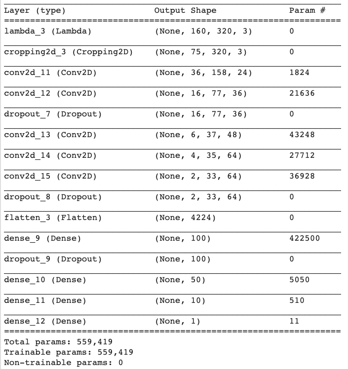

# Behavioral Cloning Project

The Project
---
The goals / steps of this project are the following:
* Use the simulator to collect data of good driving behavior 
* Design, train and validate a model that predicts a steering angle from image data
* Use the model to drive the vehicle autonomously around the first track in the simulator. The vehicle should remain on the road for an entire loop around the track.
* Summarize the results with a written report

File submission is as below:
---
* model.py: the code used to train the model on Udacity workspace in GPU mode
* (P4-model-2.ipnb: a jupyter notebook of the above code used in Google colab.)
* model.h5: a trained Keras model generated by  "model.py" 
* video.mp4: a video recording showing the car is driven by the above model. The video is both on this repo and the below youtube link. 

### Dependencies
This lab requires:

* [CarND Term1 Starter Kit](https://github.com/udacity/CarND-Term1-Starter-Kit)
* drive.py: used to feed the model to simulator
* video.py: used to generate video with the images generated by simulator 
   - The above python code is from this repo: https://github.com/udacity/CarND-Behavioral-Cloning-P3

Model architecture & Training Strategy
---

1. The model is based on Nvidia's Self-driving car model. [1]  

| Layer         		|     Matrix dimension        				    	| 
|:---------------------:|:---------------------------------------------:| 
| Input         		| 160 x 320 x 3 RGB image   							| 
| lambda         		| 160 x 320 x 3 noramlized RGB value to beween -1 to 1  					| 
| Cropping     		| Crop out top and bottom pixels that contains background (trees/sky), output 75 x 320 x3 
| Convolution (conv1)  	| 5x5 stride, same padding, outputs 36 x 158 x 24  	|
| Convolution (conv2)   	| 5x5 stride,  outputs 16 x 77 x 36 				|
| Dropout   	| 50% drop out				|
| Convolution (conv3)	    | 5x5 stride, same padding, outputs 6 x 37 x 48 |
| Convolution (conv4)	    | 3x3 stride, same padding, outputs 4 x 35 x 64 |
| Convolution (conv5)	    | 3x3 stride, same padding, outputs 2 x 33 x 64 |
| Dropout   	| 50% drop out				|
| Flatten   	| 4224				|
| Fully connected 				| outputs 100 --> 50 --> 10 -->1        			|

 

2. Two dropouts are added because overfitting was observed. 
Before adding drouput layer, training set loss is much lower than validation se as shown below. It indicates the model is overfitting on the training set data. 

3. Epoc is 5 because the MSE shows a stable value around 5 with Adam optimizer. 20% of the data is used as validation set.

4. Data set and pre-processing:
 * Downsampling at steering angle =0 : The original data set contains a large amount in 0. It is used for steering the car when the track is streight. To give the neural network more exposure to the curved track, the data set with steering angle 0 is reduced to 1/8. It is done with `df4 = df2.loc[df2['steering']==0][::8]`

 * Use images from all 3 cameras: Left camera add a angle off set of 2 and right camera is subtracted an angle of 2.

 * Horizontal flipping: To increase the training set and also make the steering angle data set symmetrical, horizontally fipped images are added to the data set. 

 * Generator: Training and validation data set went through generators to genrate pre-processed images on the fly. It avoids storing preprocessed data in memory all at once. 

 * Image cropping: All the images are cropped out with 60 pixels from the top and 25 pixels from the bottom. The cropped out pixels contain informations that is not needed for this nueral network. (eg. sky, trees,car hood, etc.)

Reference
---
[1] End to End Learning for Self-Driving Cars http://images.nvidia.com/content/tegra/automotive/images/2016/solutions/pdf/end-to-end-dl-using-px.pdf